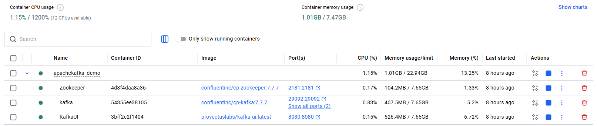
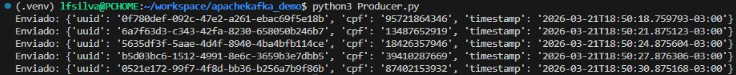
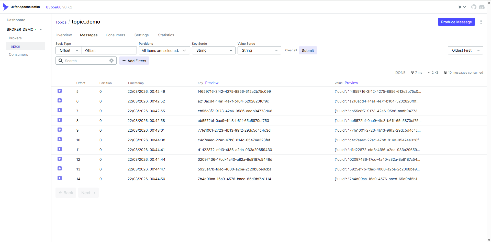
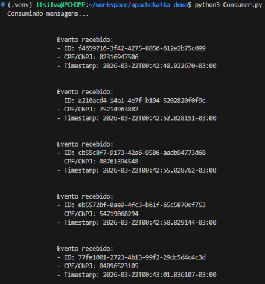

# Apache Kafka: Hands-On    
Este repositório contém o material de apoio e a demonstração técnica que apresentei no dia 20/03/2026. O objetivo principal foi desmistificar o funcionamento do **Apache Kafka** e mostrar como ele pode ser o motor de integração para um **Data Lake** eficiente.    
## 📌 Sobre o Projeto   
A apresentação cobriu desde a origem do Kafka (criado no LinkedIn) até sua arquitetura distribuída utilizando o Zookeeper. Esta demo simula um fluxo real de dados, permitindo entender como as mensagens são produzidas, armazenadas em tópicos e consumidas.  
### Tópicos Abordados:
- **História e Evolução:** De um sistema de mensageria a uma plataforma de streaming de eventos.
- **Componentes:** Broker, Topic, Producer e Consumer
---
## 🛠️ Tecnologias Utilizadas    
* **Apache Kafka** (Engine de mensageria)
* **Docker & Docker Compose** (Para orquestração do ambiente)
* **Python** (Scripts de Producer e Consumer)
* **KafkaUI** (Interface visual para monitoramento)
---

## 🚀 Como Rodar a Demonstração
### 1. Pré-requisitos
Certifique-se de ter instalado:
- Docker
- Python 3.12 ou superior
### 2. Clone o repositório
Clonar o repositório e criar o ambiente virtual
```bash
git clone https://github.com/lfsilva92/apachekafka_demo.git
cd apachekafka_demo
```
```bash
Windows:
python -m venv .venv

Linux:
python3 -m venv .venv
```
### 3. Executar a instalação das libraries do Python
```bash
pip install -r requirements.txt
```
### 4. Executar o docker compose
```bash
docker compose up -d
```

### 5. Executar código Producer.py
```bash
Windows:
python Producer.py

Linux:
python3 Producer.py
```


### 6. Executar código Consumer.py
```bash
Windows:
python Consumer.py

Linux:
python3 Consumer.py
```

---
## 💬 Feedback & Melhorias  
Este é um projeto de estudo contínuo. Se você tiver sugestões sobre:    
- Melhores práticas de configuração de tópicos;
- Otimização dos scripts de consumo;
- Casos de uso avançados (Kafka Connect, Kraft, KSQL);  

Sinta-se à vontade para abrir uma Issue ou enviar um Pull Request. Todo feedback é extremamente valioso para minha evolução como Engenheiro de Dados!   

---
Desenvolvido por Lucas Ferreira da Silva - Março/2026